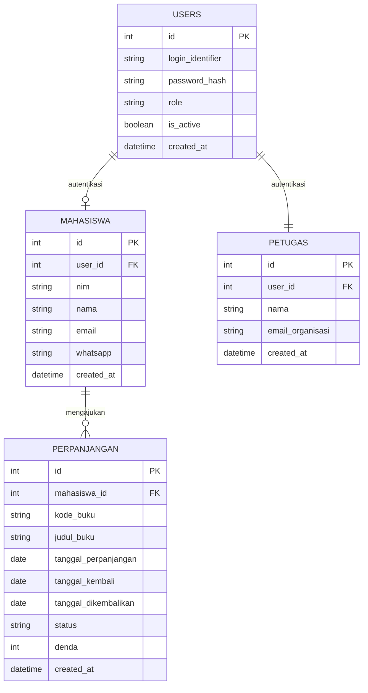
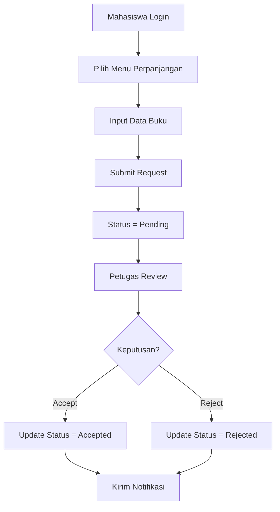
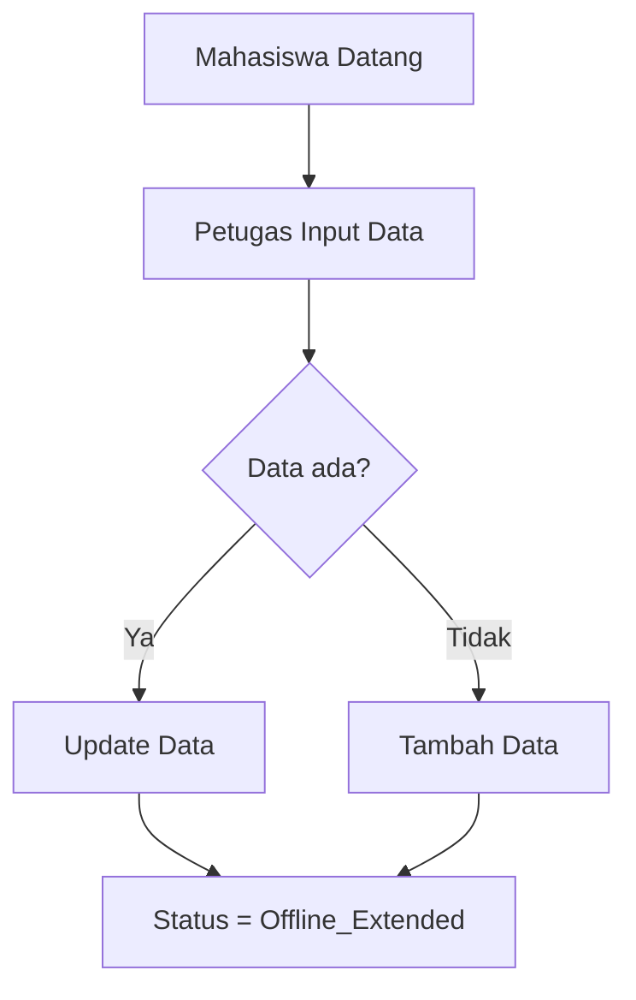

## 1️⃣ ERD (Login NIM & Email Organisasi)  

Prinsip Desain (biar konsisten & defensible)  
- Mahasiswa login pakai NIM
- Petugas login pakai email @utdi.ac.id
- Auth ≠ Identitas
- Offline tetap ditangani

## 📘 Entitas & Relasi  

### users — AUTENTIKASI

<pre>
users
------
id (PK)
login_identifier     -- NIM (mahasiswa) / email UTDI (petugas)
password_hash
role                 -- mahasiswa | petugas
is_active
created_at
</pre>

### mahasiswa — IDENTITAS MAHASISWA

<pre>
  mahasiswa
---------
id (PK)
user_id (FK, nullable)
nim
nama
email (nullable)
whatsapp (nullable)
created_at
</pre>

> 📌 Rule:  
> email OR whatsapp wajib salah satu  
> Offline → user_id = NULL

### petugas — IDENTITAS PETUGAS

<pre>
  petugas
-------
id (PK)
user_id (FK)
nama
email_organisasi
created_at
</pre>

### perpanjangan — DATA INTI  

<pre>
  perpanjangan
------------
id (PK)
mahasiswa_id (FK)
kode_buku
judul_buku
tanggal_perpanjangan
tanggal_kembali
tanggal_dikembalikan
status   -- pending | accepted | rejected | offline_extended
denda
created_at
</pre>

## ERD Diagram (Mermaid)

## 🔁 Flowchart PERPANJANGAN ONLINE

## 🧾 Flowchart PERPANJANGAN OFFLINE

