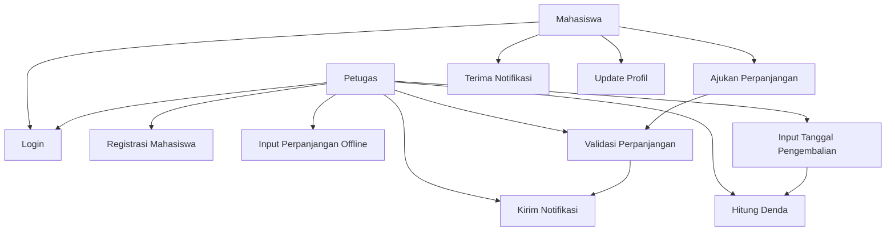
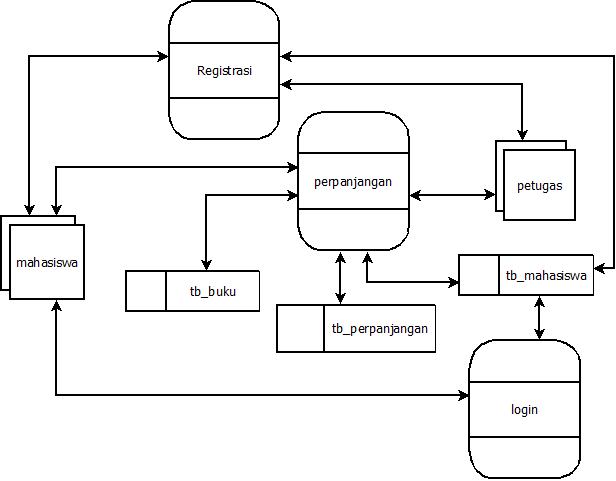

## Fitur Perpanjangan

### Deskripsi Offline
#### Perpanjangan  
  1. Mahasiswa datang dengan membawa buku pinjaman
  2. Mahasiswa melapor ke petugas
  2. Petugas melakukan input data ke sistem
  3. Sistem mengecek:
     - Jika data ada, update status
     - Jika data belum ada, tambah data baru

#### Registrasi akun oleh petugas  
   1. Petugas input nim dan kontak mahasiswa
   2. Pesan berupa username dan password dikirim ke kontak mahasiswa
   3. Mahasiswa dapat login ke akun menggunakan username dan password yang diterima.
   4. Mahasiswa dapat menambahkan kontak dan update password.

### Deskripsi Online
  1. Mahasiswa melakukan login ke sistem
  2. Mahasiswa memilih menu perpanjangan
  3. Mahasiswa melakukan input data buku dan submit
  4. Sistem menerima notifikasi
  5. Petugas mengecek dan melakukan aksi:
     - Terima (accept)
     - Tolak (reject)
  6. Mahasiswa menerima notifikasi

 

 

### DAD  

---   

