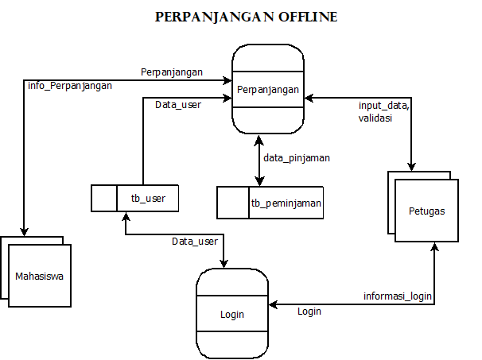

## Fitur Perpanjangan

### Deskripsi Offline

  1. Mahasiswa datang dengan membawa buku pinjaman
  2. Mahasiswa melapor ke petugas
  2. Petugas melakukan input data ke sistem
  3. Sistem memperbaharui status

### Deskripsi Online
  1. Mahasiswa melakukan login ke sistem
  2. Mahasiswa memilih menu perpanjangan
  3. Mahasiswa melakukan input data buku dan submit
  4. Sistem menerima notifikasi
  5. Petugas mengecek dan melakukan aksi:
     - Terima (accept)
     - Tolak (reject)
  6. Mahasiswa menerima notifikasi

 

### DAD versi online

### DAD versi offline

---   

