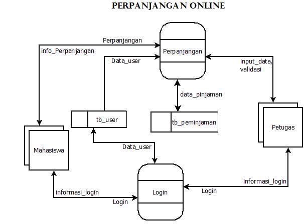
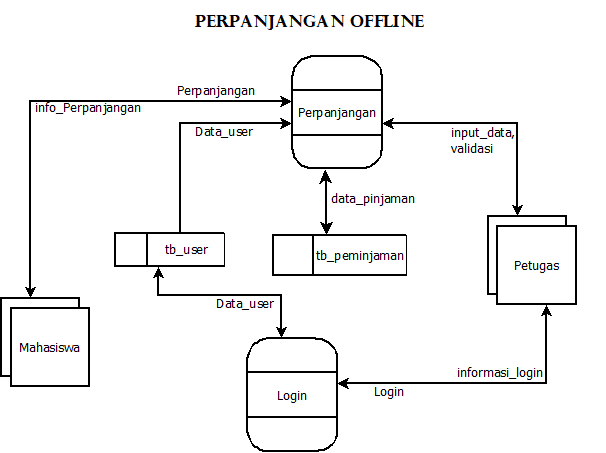

## Sistem perpanjangan

### Deskripsi Offline
- Mahasiswa datang dengan membawa buku pinjaman
- Mahasiswa melapor ke petugas:
  - Perpanjangan
  - Pengembalian
- Petugas melakukan input data ke sistem:
  - Perpanjangan
  - Pengembalian

### Deskripsi Online
- Mahasiswa melakukan login ke sistem
- Mahasiswa memilih menu perpanjangan
- Mahasiswa melakukan input data buku dan submit
- Sistem menerima notifikasi
- Petugas mengecek dan melakukan aksi:
  - Terima (accept)
  - Tolak (reject)
- Mahasiswa menerima notifikasi

### DAD versi online

### DAD versi offline

